# lbyec72-ei2-prelimactivitynumber2-donotincludeanycode-mischellefajardo
lbyec72-ei2-prelimactivitynumber2-donotincludeanycode-mischellefajardo created by GitHub Classroom

```
Main Menu
```
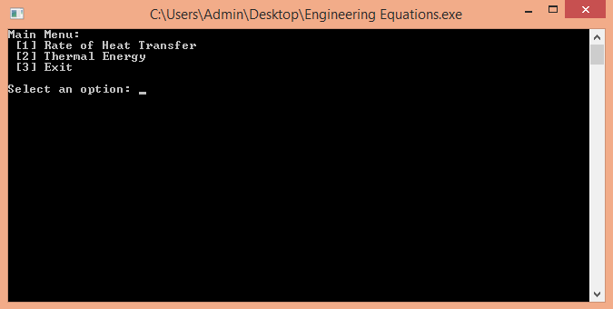

```
Option 1
```
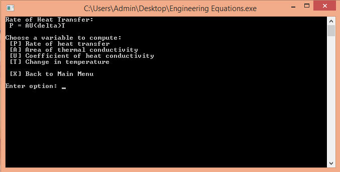

```
Option 1 Variable P
```


```
Option 1 Variable A
```
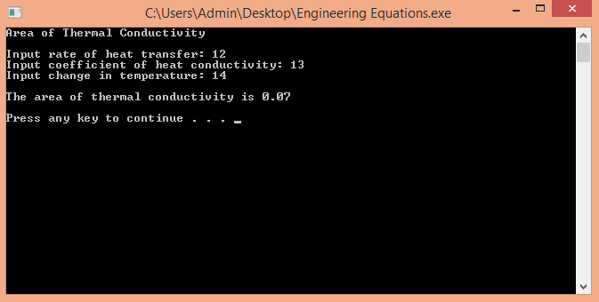

```
Option 1 Variable U
```
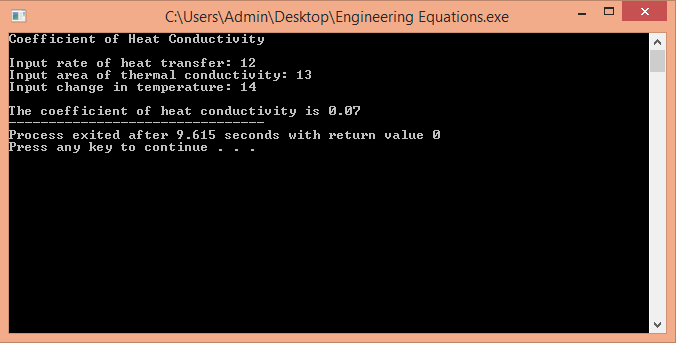

```
Option 1 Variable T
```
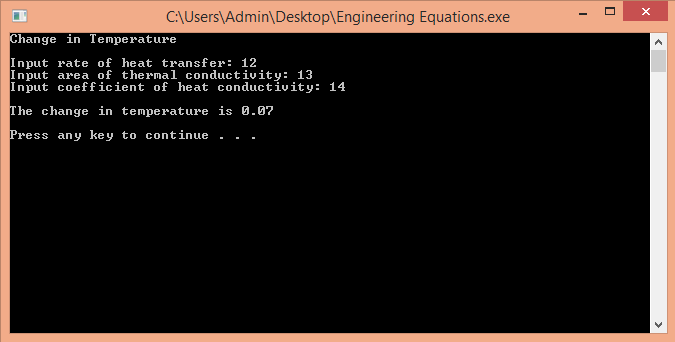

```
Option 1 Variable X
```
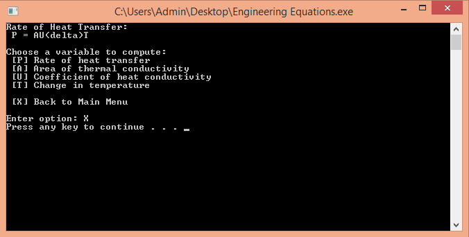

```
Option 2
```
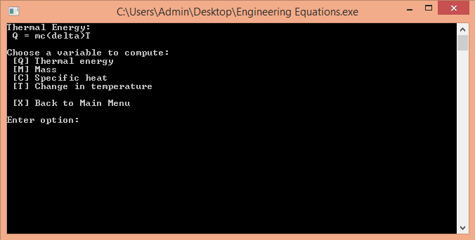

```
Option 2 Variable Q
```
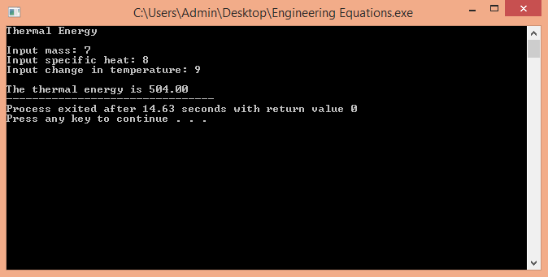

```
Option 2 Variable M
```
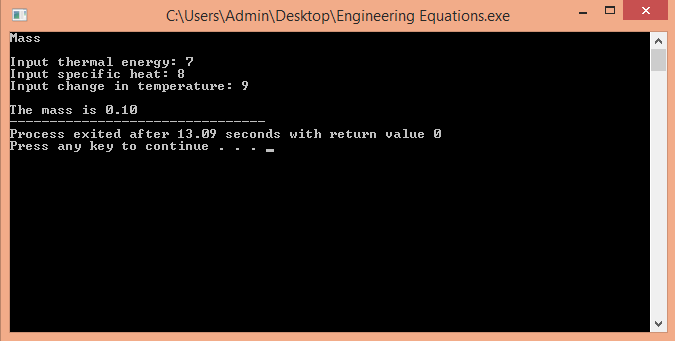

```
Option 2 Variable C
```
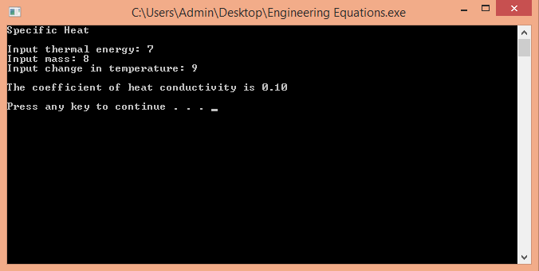

```
Option 2 Variable T
```
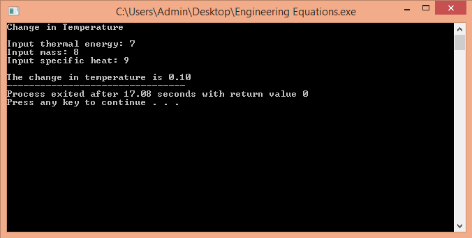

```
Option 2 Variable X
```
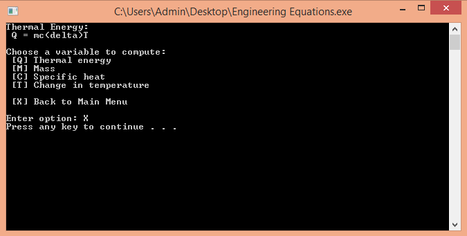

```
Option 3
```
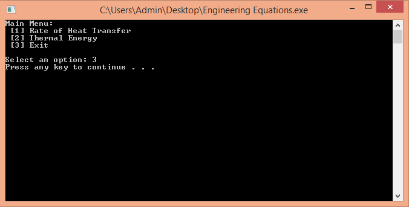

```
Invalid Choice at Main Menu
```
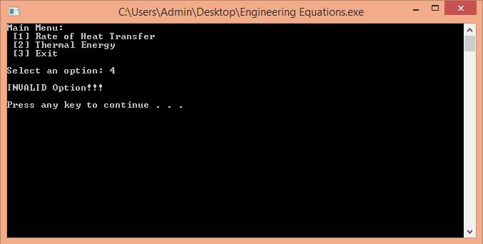

```
Invalid Choice at Option 1
```
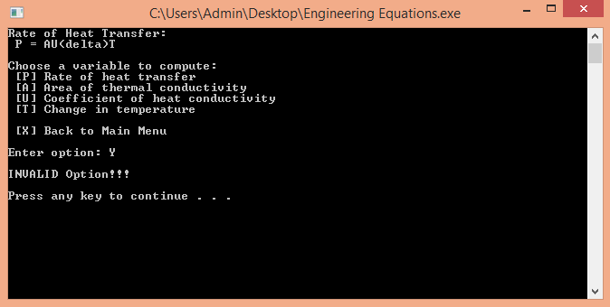

```
Invalid Choice at Option 2
```
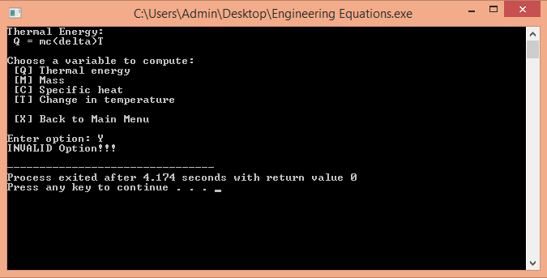
